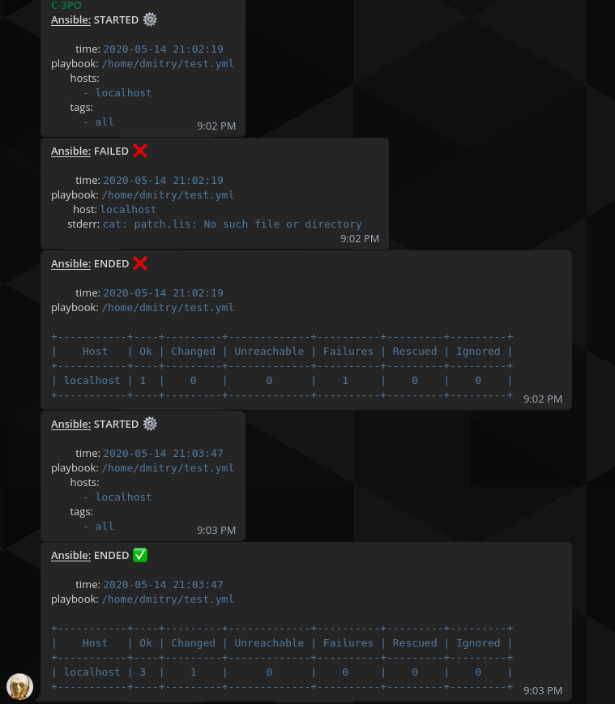

# Ansible Callback plugin for Telegram
Used for your ansible playbook notification delivery

## Requiremets
This plugin requires socks5 proxy to bypass RKN's restrictions and python libs:
  - pyTelegramBotApi
  - prettytable

## Install
1. Install python libraries

    ```sh
    $ pip install pyTelegramBotApi
    $ pip install prettytable
    ```

2. Download plugin and put it to ansible

    ```sh
    $ cd /path/to/your/ansible/plugins/callback
    $ curl -O https://github.com/dfwmlb/ansible-callback-telegram/blob/master/telegram.py
    ```

3. Add configuration to your ansible.cfg

    ```sh
    callback_whitelist = telegram

    [callback_telegram]
    tg_token = ENTER_TOKEN
    tg_chat_id = ENTER_CHAT_ID
    socks5_uri = socks5://localhost:9050
    ```

## Screens
<p align="center">
  
</p>